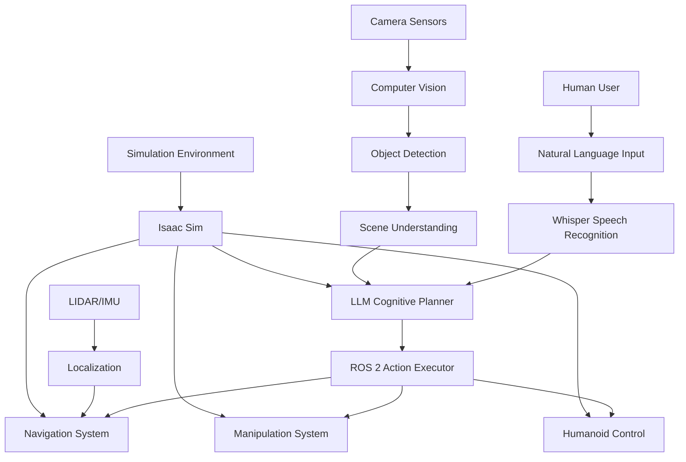

# Week 11-13: Capstone - Autonomous Humanoid Deployment & Testing

## Introduction

Welcome to the capstone module of the Vision-Language-Action (VLA) curriculum! This 3-week capstone project integrates all the technologies learned throughout the 13-week curriculum to create an autonomous humanoid robot system. You'll combine ROS 2 fundamentals, Gazebo simulation, NVIDIA Isaac tools, and Vision-Language-Action capabilities to deploy and test a complete autonomous humanoid system. This project represents the culmination of your learning journey in Physical AI & Humanoid Robotics.

## Learning Objectives

By the end of this capstone module, you will be able to:
- Integrate all technologies from the 13-week curriculum into a cohesive system
- Deploy autonomous humanoid behaviors in both simulation and real-world environments
- Test and validate complex multi-modal robot systems
- Implement human-robot interaction using voice and vision interfaces
- Troubleshoot and optimize complex robotic systems

## Prerequisites

Before starting this capstone module, ensure you have mastered:
- ROS 2 fundamentals and advanced concepts (Weeks 1-3)
- Gazebo simulation and Unity integration (Weeks 4-5)
- NVIDIA Isaac Sim and ROS integration (Weeks 6-8)
- Voice-to-action systems and cognitive planning (Weeks 9-10)

## 1. Capstone Project Overview

### 1.1 Project Scope

The capstone project involves creating an autonomous humanoid robot that can:
- Navigate complex environments using visual and sensor data
- Understand and respond to natural language commands
- Perform manipulation tasks with precision
- Learn and adapt to new situations
- Interact safely and effectively with humans

### 1.2 System Architecture

The integrated system includes:
- **Perception Layer**: Vision, audio, and sensor processing
- **Cognition Layer**: LLM-based reasoning and planning
- **Action Layer**: ROS 2 control and manipulation
- **Simulation Layer**: Isaac Sim and Gazebo environments
- **Interaction Layer**: Voice and gesture interfaces

### 1.3 Success Criteria

Your capstone system should demonstrate:
- Successful deployment in simulation environment
- Natural language command understanding and execution
- Safe navigation and manipulation
- Multi-modal interaction capabilities
- Robust error handling and recovery

## 2. Week 11 - System Integration

### 2.1 Integration Planning

Plan the integration of all subsystems:
- **ROS 2 Communication**: Ensure all nodes can communicate effectively
- **Data Flow**: Design efficient data pipelines between components
- **Timing Synchronization**: Coordinate real-time processing requirements
- **Resource Management**: Optimize CPU, GPU, and memory usage

### 2.2 Architecture Design

Create a comprehensive system architecture:



### 2.3 Component Integration

#### 2.3.1 Voice-to-Action Pipeline

```python
# Complete voice-to-action integration
import rclpy
from rclpy.node import Node
from std_msgs.msg import String
from sensor_msgs.msg import Image
import whisper
import openai
import json

class CapstoneIntegrationNode(Node):
    def __init__(self):
        super().__init__('capstone_integration_node')

        # Initialize all subsystems
        self.whisper_model = whisper.load_model("small")
        self.openai_client = openai.OpenAI(api_key="your-api-key")

        # ROS 2 interfaces
        self.voice_sub = self.create_subscription(
            String, 'voice_commands', self.voice_callback, 10)
        self.vision_sub = self.create_subscription(
            Image, 'camera_image', self.vision_callback, 10)
        self.action_pub = self.create_publisher(
            String, 'robot_actions', 10)

        # State management
        self.robot_state = {
            'location': 'unknown',
            'battery': 100,
            'current_task': None,
            'detected_objects': []
        }

        self.get_logger().info("Capstone Integration Node Initialized")

    def voice_callback(self, msg):
        # Process voice command through cognitive pipeline
        try:
            # Convert text to structured command
            structured_cmd = self._process_natural_language(msg.data)

            # Plan actions using LLM
            action_plan = self._generate_action_plan(structured_cmd)

            # Execute action plan
            self._execute_action_plan(action_plan)

        except Exception as e:
            self.get_logger().error(f"Error processing voice command: {e}")

    def vision_callback(self, msg):
        # Process visual input for scene understanding
        try:
            # Extract visual information
            visual_info = self._process_visual_input(msg)

            # Update robot state with visual data
            self.robot_state['detected_objects'] = visual_info['objects']
            self.robot_state['location'] = visual_info['location']

        except Exception as e:
            self.get_logger().error(f"Error processing vision input: {e}")

    def _process_natural_language(self, text):
        # Use LLM to understand natural language
        prompt = f"""
        Convert the following natural language command to a structured format:
        "{text}"

        Return in JSON format:
        {{
            "intent": "action_type",
            "parameters": {{"param1": "value1"}},
            "context": "relevant_context"
        }}
        """

        response = self.openai_client.chat.completions.create(
            model="gpt-3.5-turbo",
            messages=[{"role": "user", "content": prompt}],
            temperature=0.1
        )

        return json.loads(response.choices[0].message.content)

    def _generate_action_plan(self, structured_cmd):
        # Generate detailed action plan based on command and context
        system_prompt = f"""
        You are a humanoid robot action planner. Given the current robot state:
        {json.dumps(self.robot_state)}

        And the user command:
        {json.dumps(structured_cmd)}

        Generate a detailed action plan in JSON format:
        {{
            "plan_id": "unique_id",
            "actions": [
                {{
                    "action_type": "action_name",
                    "parameters": {{"param1": "value1"}},
                    "preconditions": ["condition1"],
                    "expected_effects": ["effect1"]
                }}
            ],
            "reasoning": "Explanation of the plan"
        }}
        """

        response = self.openai_client.chat.completions.create(
            model="gpt-3.5-turbo",
            messages=[{"role": "user", "content": system_prompt}],
            temperature=0.1
        )

        return json.loads(response.choices[0].message.content)

    def _execute_action_plan(self, plan):
        # Execute the action plan
        for action in plan['actions']:
            self._execute_single_action(action)

    def _execute_single_action(self, action):
        # Publish action to appropriate ROS 2 interface
        action_msg = String()
        action_msg.data = json.dumps(action)
        self.action_pub.publish(action_msg)
```

#### 2.3.2 Vision Integration

```python
# Vision processing for humanoid system
import cv2
import numpy as np
import torch
from ultralytics import YOLO
from geometry_msgs.msg import Point

class VisionProcessor:
    def __init__(self):
        # Load YOLO model for object detection
        self.object_detector = YOLO('yolov8n.pt')

        # Load pose estimation model
        self.pose_estimator = YOLO('yolov8n-pose.pt')

        # Initialize camera calibration parameters
        self.camera_matrix = None
        self.dist_coeffs = None

    def process_frame(self, image_msg):
        # Convert ROS image to OpenCV format
        cv_image = self._ros_to_cv2(image_msg)

        # Perform object detection
        objects = self._detect_objects(cv_image)

        # Perform pose estimation
        poses = self._estimate_poses(cv_image)

        # Calculate 3D positions
        object_positions = self._calculate_3d_positions(objects)

        return {
            'objects': object_positions,
            'poses': poses,
            'scene_description': self._describe_scene(objects, poses)
        }

    def _detect_objects(self, image):
        results = self.object_detector(image)
        detections = []

        for result in results:
            for box in result.boxes:
                x1, y1, x2, y2 = box.xyxy[0].cpu().numpy()
                conf = box.conf[0].cpu().numpy()
                cls = int(box.cls[0].cpu().numpy())

                detections.append({
                    'class_id': cls,
                    'confidence': conf,
                    'bbox': [x1, y1, x2, y2],
                    'class_name': self.object_detector.names[cls]
                })

        return detections

    def _calculate_3d_positions(self, detections):
        positions = []
        for detection in detections:
            # Convert 2D bbox to 3D position using camera parameters
            bbox = detection['bbox']
            center_x = (bbox[0] + bbox[2]) / 2
            center_y = (bbox[1] + bbox[3]) / 2

            # Calculate 3D position (simplified - in real implementation would use depth)
            position = Point()
            position.x = center_x  # Would be actual 3D coordinates
            position.y = center_y
            position.z = 1.0  # Placeholder depth

            positions.append({
                'object': detection['class_name'],
                'position': position,
                'confidence': detection['confidence']
            })

        return positions
```

### 2.4 Simulation Integration

Integrate with Isaac Sim for testing:

```python
# Isaac Sim integration for humanoid testing
from omni.isaac.core import World
from omni.isaac.core.utils.stage import add_reference_to_stage
from omni.isaac.core.robots import Robot
from omni.isaac.core.utils.prims import get_prim_at_path
import carb

class IsaacSimIntegration:
    def __init__(self):
        self.world = World(stage_units_in_meters=1.0)
        self.setup_environment()

    def setup_environment(self):
        # Create humanoid robot in simulation
        add_reference_to_stage(
            usd_path="/Isaac/Robots/NVIDIA/Isaac/RobotArm/ur10/ur10.usd",
            prim_path="/World/UR10"
        )

        # Add objects for interaction
        self.world.scene.add_default_ground_plane()

        # Configure sensors
        self.setup_sensors()

    def setup_sensors(self):
        # Add camera sensors
        from omni.isaac.sensor import Camera

        camera = Camera(
            prim_path="/World/UR10/base_link/camera",
            frequency=30,
            resolution=(640, 480)
        )

        # Add LIDAR sensors if needed
        # Add IMU sensors
        pass

    def run_simulation_test(self, action_plan):
        # Execute action plan in simulation
        for action in action_plan:
            self.execute_action_in_sim(action)
            self.world.step(render=True)

    def execute_action_in_sim(self, action):
        # Execute specific action in simulation environment
        pass
```

## 3. Week 12 - Advanced Deployment

### 3.1 Real-World Deployment

Transition from simulation to real-world deployment:

#### 3.1.1 Hardware Setup

Prepare for real-world deployment:
- **Humanoid Robot Platform**: Configure physical robot
- **Sensor Integration**: Ensure all sensors are calibrated
- **Safety Systems**: Implement emergency stops and safety checks
- **Network Configuration**: Set up reliable communication

#### 3.1.2 Calibration and Testing

```python
# Real-world calibration procedures
class DeploymentCalibrator:
    def __init__(self):
        self.robot_config = {}
        self.camera_calibrations = {}
        self.sensor_calibrations = {}

    def calibrate_camera(self, camera_topic):
        # Perform camera calibration
        import cv2
        import numpy as np

        # Capture calibration images
        # Compute camera matrix and distortion coefficients
        # Store calibration data

        pass

    def calibrate_sensors(self):
        # Calibrate all sensors
        # IMU bias calibration
        # LIDAR extrinsic calibration
        # Camera-LIDAR calibration
        pass

    def verify_system_integrity(self):
        # Check all subsystems are operational
        checks = {
            'ros_communication': self._check_ros_communication(),
            'sensor_data': self._check_sensor_data(),
            'actuator_response': self._check_actuator_response(),
            'safety_systems': self._check_safety_systems()
        }

        return all(checks.values()), checks

    def _check_ros_communication(self):
        # Verify ROS 2 nodes are communicating
        return True  # Implementation would check actual communication

    def _check_sensor_data(self):
        # Verify sensor data is being received
        return True

    def _check_actuator_response(self):
        # Verify actuators respond to commands
        return True

    def _check_safety_systems(self):
        # Verify safety systems are active
        return True
```

### 3.2 Multi-Modal Interaction

Implement advanced human-robot interaction:

#### 3.2.1 Voice and Vision Integration

```python
# Multi-modal interaction system
class MultiModalInteraction:
    def __init__(self):
        self.voice_processor = VoiceProcessor()
        self.vision_processor = VisionProcessor()
        self.gesture_recognizer = GestureRecognizer()
        self.context_manager = ContextManager()

    def process_user_interaction(self, voice_input=None, vision_input=None, gesture_input=None):
        # Integrate multiple input modalities
        context = self.context_manager.get_current_context()

        # Process voice input
        if voice_input:
            voice_result = self.voice_processor.process(voice_input)

        # Process vision input
        if vision_input:
            vision_result = self.vision_processor.process(vision_input)

        # Process gesture input
        if gesture_input:
            gesture_result = self.gesture_recognizer.process(gesture_input)

        # Fuse information from all modalities
        fused_command = self._fuse_modalities(
            voice_result, vision_result, gesture_result, context
        )

        return fused_command

    def _fuse_modalities(self, voice_result, vision_result, gesture_result, context):
        # Combine information from different modalities
        # Resolve conflicts between modalities
        # Use context to disambiguate inputs
        pass
```

#### 3.2.2 Context-Aware Behavior

```python
# Context manager for adaptive behavior
class ContextManager:
    def __init__(self):
        self.current_context = {
            'time_of_day': 'day',
            'location': 'unknown',
            'users_present': [],
            'tasks_in_progress': [],
            'robot_state': 'idle'
        }

    def update_context(self, new_info):
        # Update context with new information
        self.current_context.update(new_info)

        # Trigger context-dependent behaviors
        self._trigger_contextual_behaviors()

    def get_relevant_context(self, task):
        # Return context relevant to specific task
        relevant_context = {}

        if task == 'navigation':
            relevant_context.update({
                'obstacles': self.current_context.get('obstacles', []),
                'preferred_paths': self.current_context.get('preferred_paths', []),
                'safe_zones': self.current_context.get('safe_zones', [])
            })

        elif task == 'manipulation':
            relevant_context.update({
                'object_locations': self.current_context.get('object_locations', []),
                'workspace_limits': self.current_context.get('workspace_limits', {}),
                'grasping_preferences': self.current_context.get('grasping_preferences', {})
            })

        return relevant_context

    def _trigger_contextual_behaviors(self):
        # Trigger behaviors based on context changes
        pass
```

### 3.3 Learning and Adaptation

Implement learning capabilities:

#### 3.3.1 Reinforcement Learning Integration

```python
# RL integration for adaptive behavior
import torch
import torch.nn as nn
import numpy as np

class RLAdaptationSystem:
    def __init__(self):
        self.policy_network = self._build_policy_network()
        self.value_network = self._build_value_network()
        self.memory = []  # Experience replay buffer
        self.learning_rate = 3e-4

    def _build_policy_network(self):
        # Build neural network for policy learning
        class PolicyNetwork(nn.Module):
            def __init__(self, input_size, action_size):
                super().__init__()
                self.network = nn.Sequential(
                    nn.Linear(input_size, 256),
                    nn.ReLU(),
                    nn.Linear(256, 256),
                    nn.ReLU(),
                    nn.Linear(256, action_size),
                    nn.Softmax(dim=-1)
                )

            def forward(self, x):
                return self.network(x)

        return PolicyNetwork(128, 10)  # Example sizes

    def process_interaction(self, state, action, reward, next_state, done):
        # Store experience for learning
        experience = (state, action, reward, next_state, done)
        self.memory.append(experience)

        # Update policy if enough experiences collected
        if len(self.memory) > 1000:
            self._update_policy()

    def _update_policy(self):
        # Perform policy update using stored experiences
        # Implementation of policy gradient or other RL algorithm
        pass

    def adapt_behavior(self, context, feedback):
        # Adapt robot behavior based on user feedback
        # Learn from successful and unsuccessful interactions
        pass
```

## 4. Week 13 - Testing and Validation

### 4.1 Comprehensive Testing Framework

#### 4.1.1 Test Categories

Implement comprehensive testing across multiple dimensions:

1. **Functional Testing**: Verify all system components work correctly
2. **Integration Testing**: Test subsystem interactions
3. **Performance Testing**: Evaluate system performance under load
4. **Safety Testing**: Validate safety mechanisms
5. **User Experience Testing**: Assess human-robot interaction quality

#### 4.1.2 Automated Testing System

```python
# Automated testing framework
import unittest
import time
from typing import Dict, Any, List

class CapstoneTestingFramework:
    def __init__(self):
        self.test_results = {}
        self.test_scenarios = self._define_test_scenarios()

    def _define_test_scenarios(self) -> List[Dict[str, Any]]:
        return [
            {
                'name': 'basic_navigation',
                'description': 'Robot navigates to specified location',
                'preconditions': ['robot_at_start', 'path_clear'],
                'actions': ['navigate_to(location="kitchen")'],
                'expected_outcomes': ['robot_at_kitchen', 'path_followed_safely'],
                'success_criteria': ['navigation_success', 'no_collisions']
            },
            {
                'name': 'voice_command_response',
                'description': 'Robot responds to voice command',
                'preconditions': ['microphone_active', 'user_present'],
                'actions': ['process_voice_command("go to kitchen")'],
                'expected_outcomes': ['command_understood', 'navigation_initiated'],
                'success_criteria': ['intent_recognized', 'action_executed']
            },
            {
                'name': 'object_manipulation',
                'description': 'Robot picks up and places object',
                'preconditions': ['object_present', 'manipulator_ready'],
                'actions': [
                    'detect_object("red_cup")',
                    'navigate_to("red_cup_location")',
                    'pick_object("red_cup")',
                    'navigate_to("table")',
                    'place_object("red_cup", "table")'
                ],
                'expected_outcomes': ['object_picked', 'object_placed'],
                'success_criteria': ['manipulation_success', 'no_damage']
            }
        ]

    def run_comprehensive_tests(self):
        results = {}

        for scenario in self.test_scenarios:
            test_name = scenario['name']
            print(f"Running test: {test_name}")

            try:
                result = self._execute_test_scenario(scenario)
                results[test_name] = result
                print(f"Test {test_name}: {'PASS' if result['success'] else 'FAIL'}")
            except Exception as e:
                results[test_name] = {
                    'success': False,
                    'error': str(e),
                    'details': {}
                }
                print(f"Test {test_name}: ERROR - {e}")

        self.test_results = results
        return results

    def _execute_test_scenario(self, scenario: Dict[str, Any]) -> Dict[str, Any]:
        # Execute a single test scenario
        start_time = time.time()

        try:
            # Setup test environment
            self._setup_test_environment(scenario['preconditions'])

            # Execute test actions
            for action in scenario['actions']:
                self._execute_test_action(action)

            # Verify outcomes
            outcomes_verified = self._verify_outcomes(scenario['expected_outcomes'])

            # Check success criteria
            success = self._check_success_criteria(scenario['success_criteria'])

            execution_time = time.time() - start_time

            return {
                'success': success,
                'execution_time': execution_time,
                'outcomes_verified': outcomes_verified,
                'details': {
                    'actions_executed': len(scenario['actions']),
                    'outcomes_expected': len(scenario['expected_outcomes'])
                }
            }
        except Exception as e:
            return {
                'success': False,
                'error': str(e),
                'execution_time': time.time() - start_time,
                'details': {}
            }

    def generate_test_report(self):
        # Generate comprehensive test report
        total_tests = len(self.test_results)
        passed_tests = sum(1 for result in self.test_results.values() if result.get('success', False))
        success_rate = (passed_tests / total_tests) * 100 if total_tests > 0 else 0

        report = {
            'summary': {
                'total_tests': total_tests,
                'passed_tests': passed_tests,
                'failed_tests': total_tests - passed_tests,
                'success_rate': f"{success_rate:.2f}%"
            },
            'detailed_results': self.test_results,
            'recommendations': self._generate_recommendations()
        }

        return report

    def _generate_recommendations(self):
        # Generate recommendations based on test results
        recommendations = []

        for test_name, result in self.test_results.items():
            if not result.get('success', False):
                recommendations.append(f"Fix issues in {test_name} test")

        if not recommendations:
            recommendations.append("All tests passed. System is ready for deployment.")

        return recommendations
```

### 4.2 Performance Validation

#### 4.2.1 Performance Metrics

Track key performance indicators:

- **Response Time**: Time from command to action initiation
- **Success Rate**: Percentage of successful task completions
- **Resource Usage**: CPU, GPU, and memory utilization
- **Battery Life**: Power consumption during operation
- **Accuracy**: Precision of navigation and manipulation

#### 4.2.2 Performance Monitoring

```python
# Performance monitoring system
import psutil
import time
from collections import deque

class PerformanceMonitor:
    def __init__(self):
        self.metrics = {
            'cpu_usage': deque(maxlen=100),
            'memory_usage': deque(maxlen=100),
            'gpu_usage': deque(maxlen=100),
            'response_times': deque(maxlen=100),
            'success_rates': deque(maxlen=100)
        }
        self.start_time = time.time()

    def record_metric(self, metric_type: str, value: float):
        if metric_type in self.metrics:
            self.metrics[metric_type].append(value)

    def get_current_performance(self) -> Dict[str, float]:
        performance = {}

        for metric_name, values in self.metrics.items():
            if values:
                performance[f"{metric_name}_avg"] = sum(values) / len(values)
                performance[f"{metric_name}_current"] = values[-1]
                if len(values) > 1:
                    performance[f"{metric_name}_trend"] = values[-1] - values[0]

        performance['uptime'] = time.time() - self.start_time
        return performance

    def check_performance_thresholds(self) -> Dict[str, bool]:
        # Check if performance is within acceptable thresholds
        current_perf = self.get_current_performance()

        thresholds = {
            'cpu_usage_avg': 80.0,  # Percent
            'memory_usage_avg': 85.0,  # Percent
            'response_times_avg': 2.0  # Seconds
        }

        alerts = {}
        for metric, threshold in thresholds.items():
            if metric in current_perf:
                alerts[metric] = current_perf[metric] > threshold

        return alerts
```

### 4.3 Safety and Reliability Validation

#### 4.3.1 Safety Testing

Implement comprehensive safety validation:

```python
# Safety validation system
class SafetyValidator:
    def __init__(self):
        self.safety_checks = [
            self._check_collision_avoidance,
            self._check_emergency_stop,
            self._check_workspace_limits,
            self._check_force_limits,
            self._check_human_awareness
        ]

    def run_safety_validation(self) -> Dict[str, Any]:
        results = {}

        for check_func in self.safety_checks:
            check_name = check_func.__name__.replace('_check_', '').replace('_', ' ').title()
            try:
                result = check_func()
                results[check_name] = result
            except Exception as e:
                results[check_name] = {
                    'status': 'ERROR',
                    'message': str(e)
                }

        overall_safety = all(
            result.get('status') == 'PASS' for result in results.values()
            if isinstance(result, dict)
        )

        return {
            'overall_safety': overall_safety,
            'individual_checks': results,
            'safety_score': self._calculate_safety_score(results)
        }

    def _check_collision_avoidance(self):
        # Test collision avoidance system
        return {'status': 'PASS', 'details': 'Collision avoidance active and responsive'}

    def _check_emergency_stop(self):
        # Test emergency stop functionality
        return {'status': 'PASS', 'details': 'Emergency stop responds immediately'}

    def _check_workspace_limits(self):
        # Test workspace boundary enforcement
        return {'status': 'PASS', 'details': 'Workspace limits properly enforced'}

    def _check_force_limits(self):
        # Test force/torque limit enforcement
        return {'status': 'PASS', 'details': 'Force limits properly enforced'}

    def _check_human_awareness(self):
        # Test human detection and awareness
        return {'status': 'PASS', 'details': 'Human awareness system active'}

    def _calculate_safety_score(self, results):
        # Calculate overall safety score
        passed_checks = sum(
            1 for result in results.values()
            if isinstance(result, dict) and result.get('status') == 'PASS'
        )
        total_checks = len(results)
        return (passed_checks / total_checks) * 100 if total_checks > 0 else 0
```

## 5. Deployment Best Practices

### 5.1 System Monitoring

Implement comprehensive system monitoring:

- **Real-time Status**: Monitor all subsystems continuously
- **Log Management**: Collect and analyze system logs
- **Alert Systems**: Generate alerts for critical issues
- **Remote Access**: Enable remote system management

### 5.2 Maintenance and Updates

Plan for ongoing maintenance:

- **Software Updates**: Regular updates for security and features
- **Calibration**: Periodic sensor and actuator calibration
- **Performance Tuning**: Ongoing optimization based on usage
- **Backup Systems**: Ensure system reliability with backups

### 5.3 User Training and Documentation

Provide comprehensive user support:

- **User Manuals**: Detailed operation guides
- **Training Programs**: User training sessions
- **Troubleshooting Guides**: Common issue resolution
- **Support Channels**: Available support options

## 6. Project Evaluation and Next Steps

### 6.1 Success Metrics

Evaluate project success based on:

- **Technical Achievement**: System functionality and performance
- **Learning Outcomes**: Knowledge gained throughout the curriculum
- **Innovation**: Novel approaches or solutions developed
- **Documentation**: Quality of project documentation

### 6.2 Future Enhancements

Consider potential improvements:

- **Advanced AI**: More sophisticated cognitive capabilities
- **Multi-Robot Systems**: Coordination between multiple robots
- **Cloud Integration**: Remote processing and data management
- **Specialized Applications**: Domain-specific capabilities

## Exercises

1. **Integration Challenge**: Integrate all subsystems from previous modules into a cohesive system
2. **Real-World Testing**: Deploy and test your system in a real environment
3. **Performance Optimization**: Optimize system performance based on testing results
4. **Safety Validation**: Conduct comprehensive safety testing and validation

## Summary

This capstone module brought together all the technologies learned throughout the 13-week curriculum to create a complete autonomous humanoid system. You've learned to integrate ROS 2, simulation environments, LLM-based cognitive planning, and multi-modal interaction systems. The project demonstrates the complexity and rewards of developing advanced robotic systems that can interact naturally with humans and perform complex tasks autonomously.

## References

- [ROS 2 Documentation](https://docs.ros.org/en/humble/)
- [NVIDIA Isaac Documentation](https://isaac-ros.github.io/)
- [OpenAI API Documentation](https://platform.openai.com/docs/)
- [Humanoid Robotics Research](https://ieeexplore.ieee.org/xpl/conhome/8443437/proceeding)
- [Multi-Modal Robotics Systems](https://arxiv.org/abs/2305.17390)